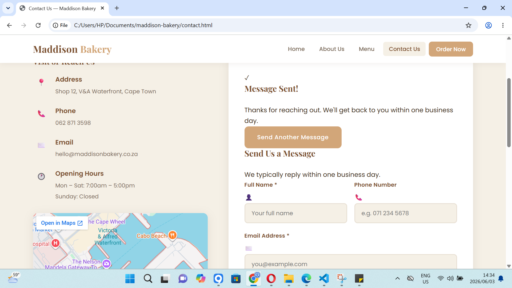
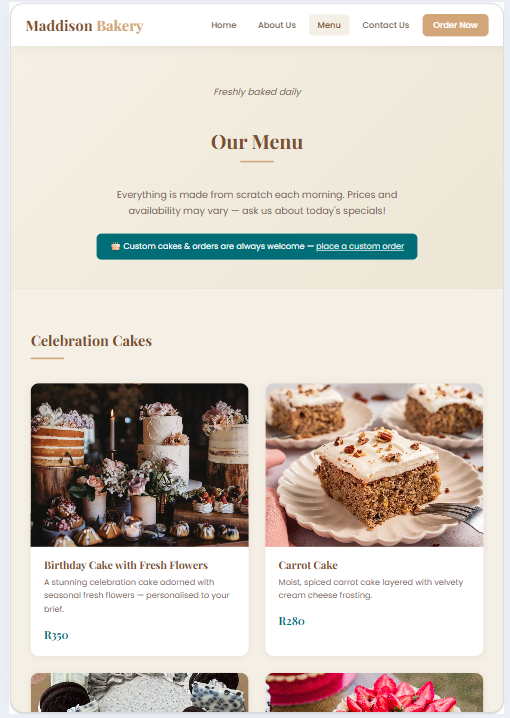
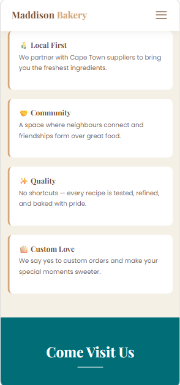
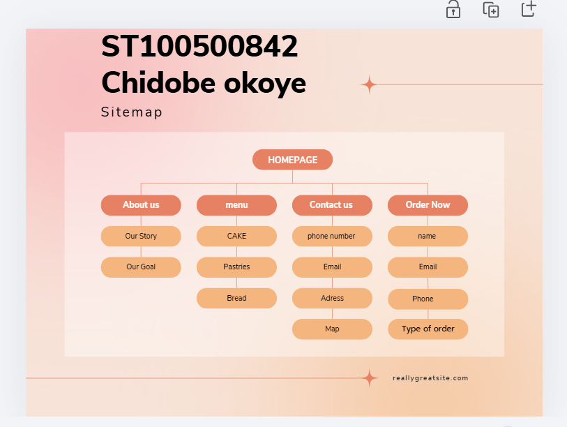

# Maddison Bakery Website

## Project Overview

Maddison Bakery is a responsive multi-page bakery website created for a fictional artisanal bakery located in Cape Town. The project was developed as part of a Web Development portfolio assignment and focuses on responsive design, usability, accessibility, and visual consistency.

The website allows users to:

* Browse bakery products
* Learn about the bakery
* Contact the business
* Submit custom order enquiries

Part 2 expanded the project significantly by introducing responsive CSS styling, reusable layouts, mobile optimisation, improved navigation, and enhanced documentation.

---

# Website Goals and Objectives

* Improve Maddison Bakery’s online presence
* Create a warm and professional bakery brand identity
* Improve user navigation and accessibility
* Provide customers with easy access to bakery information
* Ensure compatibility across desktop, tablet, and mobile devices

---

# Technologies Used

* HTML5
* CSS3
* CSS Variables
* CSS Flexbox
* CSS Grid
* Media Queries
* Google Fonts
* Visual Studio Code
* GitHub

---

# Pages Included

1. Home Page (`index.html`)
2. About Us Page (`about.html`)
3. Menu Page (`menu.html`)
4. Contact Us Page (`contact.html`)
5. Order Form Page (`order.html`)

---

# File and Folder Structure
 maddison-bakery/
css/ (Contains the external stylesheet)
style.css
images/ (Contains all images)
index.html (Home page)
about.html (About page)      
menu.html (Menu page)
contact.html (Contact page)
order.html (Order page)

# Design and User Experience

## Colour Palette

The website uses a warm bakery-inspired colour palette supported by additional text, contrast, shadow, and overlay colours.

### Primary Brand Colours

* Caramel: `#D2A679`
* Cream: `#F5F0E6`
* Teal: `#006D77`

### Supporting Colours

* Dark Teal: `#005560`
* Brown: `#7A4F2F`
* Dark Text: `#3A2A1A`
* Muted Text: `#7A6A5A`
* White: `#FFFFFF`

### Additional Styling Colours

Additional colours and transparency values were used for:

* hover effects
* shadows
* borders
* overlays
* form focus states
* footer text
* image contrast

CSS variables were used to keep the main colour system consistent and easy to update across all pages.

## Typography

* Playfair Display was used for headings
* Poppins was used for body text

These fonts improve readability while maintaining an elegant bakery aesthetic.

## Layout and Responsiveness

The website uses responsive layouts built with CSS Grid and Flexbox. Media queries were implemented to ensure usability across:

* Desktop
* Tablet
* Mobile devices

Navigation, forms, buttons, grids, and content sections automatically adjust to different screen sizes.

---

# Responsive Testing Evidence

## Desktop View

## Tablet View

## Mobile View

Testing was completed using browser developer tools to ensure:

* Responsive layouts
* Proper scaling
* Mobile usability
* Readable typography
* Accessible navigation
* Functional forms

---

# Sitemap

Home → About Us → Menu → Contact Us → Order Now

## Visual Sitemap

---

# Comments in Code

Detailed comments were added throughout the HTML and CSS files to explain:

* Navigation sections
* Hero sections
* Forms
* Footer structure
* Layout sections
* Responsive design areas

---

# ChangeLog

## Part 1 Corrections

The following corrections were made based on Part 1 feedback:

* Improved proposal documentation
* Added additional references
* Improved budget explanation
* Updated sitemap
* Improved file structure
* Fixed image paths
* Improved semantic HTML structure
* Added clearer comments
* Improved page content consistency

## Part 2 Improvements

* Added external stylesheet
* Added responsive media queries
* Improved mobile responsiveness
* Added sticky navigation
* Added hamburger menu
* Added active navigation states
* Added hover effects and transitions
* Added reusable CSS utility classes
* Improved form design and layout
* Improved order form usability
* Improved typography hierarchy
* Improved visual consistency
* Added CSS variables
* Added responsive grids
* Improved accessibility with descriptive alt text
* Added responsive testing evidence

---

# AI Usage Acknowledgement

Artificial intelligence tools were used to assist with documentation refinement, code explanation, responsive design guidance, and proofreading during the development of this academic project. All implementation, testing, editing, and final submission decisions were completed by the student.

---

# References

99designs. (n.d.). Website usability principles. Available at: https://99designs.com/blog/web-digital/website-usability-principles/

Google Fonts. (n.d.). Fonts library. Available at: https://fonts.google.com/

MDN Web Docs. (n.d.). CSS: Cascading Style Sheets. Available at: https://developer.mozilla.org/en-US/docs/Web/CSS

OpenAI. (2026). ChatGPT (GPT-5.5) [Large language model]. Available at: https://chat.openai.com/

Unsplash. (n.d.). Free high-quality images. Available at: https://unsplash.com/

W3Schools. (n.d.). HTML Responsive Web Design. Available at: https://www.w3schools.com/html/html_responsive.asp

---

# Author

Student Name: Chidobe Okoye

Student Number: ST10500842

Module: Web Development

Project: Maddison Bakery Website – Part 2
